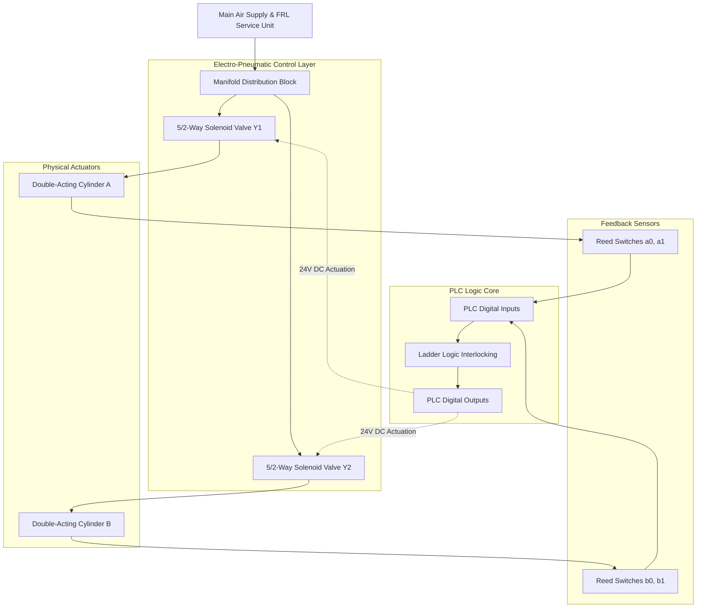

# P17: Electro-Pneumatic PLC Automation

## Executive Overview
Automated manufacturing processes, ranging from packaging lines to robotic assembly cells, rely heavily on the integration of fluid power mechanics and programmable digital logic. This project details the design and simulation of a deterministic **Electro-Pneumatic Sequencing System**. Utilizing Automation Studio, a rigorous multi-actuator sequence is physically modeled and controlled via classical PLC Ladder Logic, mapping the pneumatic state transitions directly to digital I/O feedback.

> [!CAUTION]
> **Industrial Fluid Power Safety Callout**
> Pneumatic systems typically operate at high kinetic energy potentials ($6-8\text{ bar}$ / $87-116\text{ psi}$). Maintenance requires strict **Lockout/Tagout (LOTO)** procedures incorporating dump valves to purge residual trapped air. Actuators generate massive instantaneous forces and travel at high velocities, creating severe mechanical pinch/crush points. Careful consideration must be paid to the fail-safe states of solenoid valves (spring-return vs. detented) to prevent unexpected actuation upon power loss or emergency stops (E-Stop).

## System Highlights
- **Multi-Actuator Sequencing**: Executes a precise interlocking cascade (e.g., A+ B+ A- B-) utilizing fluid power kinematics.
- **5/2-Way Directional Solenoid Valves**: Implements high-flow pilot-operated pneumatic switching for double-acting cylinders.
- **Magnetic Reed Position Feedback**: Integrates non-contact limit switches to communicate true physical actuator states back to the control layer.
- **PLC-Based Signal Interlocking**: Resolves classical sequencing signal conflicts (overlapping signals) using Boolean latching/memory states in Ladder Logic.

## System Architecture Diagram

## Theoretical & Mathematical Models

### 1. Theoretical Extension Force ($F_{ext}$)
The maximum output force during the outward stroke is a function of the system pressure ($P_{sys}$) acting on the full piston bore diameter ($D$):
$$F_{ext} = P_{sys} \cdot A_{piston} = P_{sys} \cdot \frac{\pi D^2}{4}$$

### 2. Theoretical Retraction Force ($F_{ret}$)
During the return stroke, the force is reduced due to the surface area displaced by the piston rod ($d$):
$$F_{ret} = P_{sys} \cdot (A_{piston} - A_{rod}) = P_{sys} \cdot \frac{\pi (D^2 - d^2)}{4}$$

### 3. Effective Dynamic Actuation Force
Frictional losses within the cylinder seals (typically $10-15\%$) mean the true dynamic force available to move the load ($F_{eff}$) is less than the theoretical static force:
$$F_{eff} = \eta_{mech} \cdot F_{theoretical} \quad (\text{where } \eta_{mech} \approx 0.85 - 0.90)$$

### 4. Normalized Free Air Consumption ($Q_{N}$)
To size the industrial compressor correctly, the total air consumed per double stroke (normalized to atmospheric conditions) is computed as:
$$Q_{N} = \frac{\pi}{4} \left(2D^2 - d^2\right) \cdot s \cdot \frac{P_{sys} + P_{atm}}{P_{atm}} \cdot 10^{-6} \quad [\text{NL/cycle}]$$
*(Where $s$ is stroke length in mm).*

### 5. Signal Overlap Prevention & Latching
In sequences where a limit switch is physically held down while its opposite motion is requested (e.g., commanding A- while a1 is still pressed), signal conflicts occur. The PLC resolves this via Set-Reset (SR) latching arrays or memory flag shifting:
$$M_{step(n)} = (\text{Sensor\_Trigger} \text{ AND } M_{step(n-1)}) \text{ OR } M_{step(n)} \text{ AND NOT } M_{step(n+1)}$$

## Displacement-Step Diagram & Sequence Matrix
| Step | Action | PLC Memory State | Sensor Triggering Transition | Active Solenoid |
| :---: | :--- | :---: | :--- | :--- |
| **0** | Idle | `M0.0` | `a0` AND `b0` = TRUE | None (Start Button Pending) |
| **1** | A+ (Cyl A Extends) | `M0.1` | `a0` $\rightarrow$ `a1` | `Y1 (A+)` |
| **2** | B+ (Cyl B Extends) | `M0.2` | `a1` $\rightarrow$ `b1` | `Y3 (B+)` |
| **3** | A- (Cyl A Retracts)| `M0.3` | `b1` $\rightarrow$ `a0` | `Y2 (A-)` |
| **4** | B- (Cyl B Retracts)| `M0.4` | `a0` $\rightarrow$ `b0` | `Y4 (B-)` |

## Hardware / Component Allocation Table
| Component | Topology / Specification | Function |
| :--- | :--- | :--- |
| **Pneumatic Cylinders** | Double-Acting, Magnetic Piston | Primary mechanical actuation |
| **Control Valves** | 5/2-Way Directional Solenoid | Airflow commutation |
| **Feedback Sensors** | Magnetic Reed Switches (NO) | End-of-stroke verification |
| **FRL Unit** | Filter, Regulator, Lubricator | Air supply conditioning ($6 \text{ bar}$) |
| **PLC Output Relays** | 24V DC / 2A Discrete outputs | Solenoid coil energization |

## Authentic Artifacts Catalog
- **Engineering Reports**: [`docs/`](docs/) contains the detailed sequence logic models.
- **Simulation Logic & Waveforms**: [`docs/images/`](docs/images/) houses the original Automation Studio layout maps and screenshot captures as **[ORIGINAL SIMULATION & LOGIC ARTIFACTS]**.

## Engineering Audit & Tradeoffs
- **Relay Hardwired Sequencing vs. PLC Software Control**: Historically, signal overlaps in fluid power were solved using mechanical cascade valves or massive arrays of electromagnetic relays. These are incredibly difficult to debug and modify. Moving the cascade logic into PLC software allows for instant sequence modification (e.g., changing from A+ B+ A- B- to A+ B+ B- A-) without requiring a single wire to be moved in the physical cabinet.
- **Monostable vs. Bistable Solenoid Valves**: A 5/2 monostable valve (spring return) requires continuous electrical power to stay actuated, meaning the cylinder will violently retract upon a power failure. A 5/2 bistable valve (detented) retains its last shifted position upon power failure, keeping the load clamped safely in place. Selection is critical based on the required E-Stop safety state.

---

**Hassan Moqbel Morshed Ghaleb**
Mechatronics Engineer | Mechanical Design & CAD (SolidWorks & AutoCAD) | Preventive Maintenance & Electromechanical Systems | Industrial Automation, Control Systems, Robotics & Intelligent Machines | CAD/FEA, Embedded Systems, Python & C++
[GitHub](https://github.com/Hassan-Moqbel) · [Facebook](https://www.facebook.com/share/1BqxAgVjHi/) · [LinkedIn](https://www.linkedin.com/in/hassan-moqbel)

## License
This project is licensed under the [MIT License](LICENSE).
